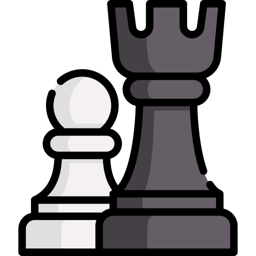
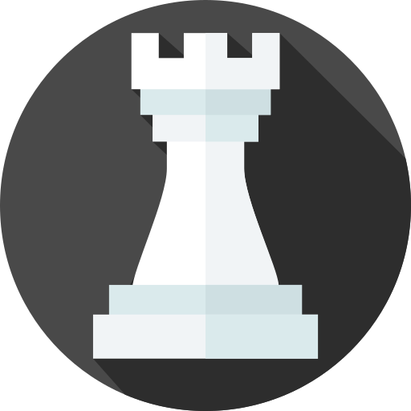
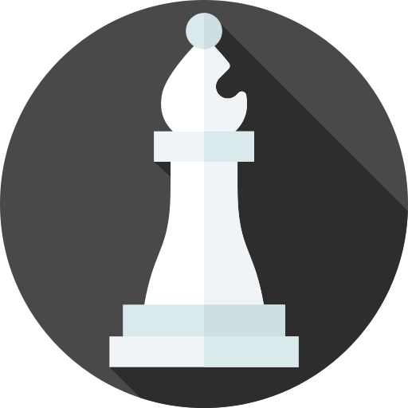

<h1 align="center">
     
    <br>Design Patterns Chess Game <br/>
</h1>

<p align="center">
  
  
   
  
</p>

<p align="center">
  <a href="#bookmark-about">About</a>&nbsp;&nbsp;&nbsp;|&nbsp;&nbsp;&nbsp;
  <a href="#construction_worker-structure">Project Structure</a>&nbsp;&nbsp;&nbsp;|&nbsp;&nbsp;&nbsp;
  <a href="#book-How_to_Play_Chess">How to Play Chess</a>&nbsp;&nbsp;&nbsp;|&nbsp;&nbsp;&nbsp;
  <a href="#boom-how-to-run">How to run</a>&nbsp;&nbsp;&nbsp;|&nbsp;&nbsp;&nbsp;
  <a href="#memo-license">License</a>
</p>
<br>
<p align="center">
	
</p>

## :bookmark: About

<p>This Application was developed to apply the knowledge acquired in Java studies.<p>
<p>Applying design patterns in a chess game</p>
 

## :construction_worker: Structure

<p align="center">
  
<p>

#### First class: Position

* **Checklist:**
    * Class Position [public]
    * **OOP Topics:**
        * Encapsulation
        * Constructors
        * ToString (Object / overriding)

#### Starting to implement Board and Piece

* **Checklist:**
    * Classes Piece, Board [public]
    * **OOP Topics:**
    *  Associations
    *  Encapsulation / Access Modifiers

#### Chess layer and printing the board

```
8 - - - - - - - -
7 - - - - - - - -
6 - - - - - - - -
5 - - - - - - - -
4 - - - - - - - -
3 - - - - - - - -
2 - - - - - - - -
1 - - - - - - - - 
  a b c d e f g h
```

* **Checklist:** 
   * Methods: Board.Piece(row, column) and Board.Piece(position)
   * Enum Chess.Color
   * Class Chess.ChessPiece [public]
   * Class Chess.ChessMatch [public]
   * Class ChessConsole.UI
   * **OOP Topics:**
        * Enumerations
        * Encapsulation / Access Modifiers
        * Inheritance
        * Downcasting
        * Static members
        * Layers pattern
        
####  Placing pieces on the board

* **Checklist:**
    * Method: Board.PlacePiece(piece, position)
    * Classes: Rook, King [public]
    * Method: ChessMatch.InitialSetup
    * **OOP Topics:**
        * Inheritance
        * Overriding
        * Polymorphism (ToString)  
        
#### BoardException and defensive programming

* **Checklist:**
    * Class BoardException [public]
    * Methods: Board.PositionExists, Board.ThereIsAPiece
    * Implement defensive programming in Board methods
    * **OOP Topics:**
        * Exceptions
        * Constructors (a string must be informed to the exception)

#### ChessException and ChessPosition

* **Checklist:**
    * Class ChessException [public]
    * Class ChessPosition [public]
    * Refactor ChessMatch.InitialSetup
    * **OOP Topics:**
        * Exceptions
        * Encapsulation
        * Constructors (a string must be informed to the exception)
        * Overriding
        * Static members
        * Layers pattern

#### Little improvement in board printing

* **Color in terminal:**
* Windows: Git Bash
* Mac: Google "osx terminal color"
    * **Checklist:**
      * Place more pieces on the board
      * Distinguish piece colors in UI.PrintPiece method
  
#### Moving pieces

* **Checklist:**
    * Method Board.RemovePiece
    * Method UI.ReadChessPosition
    * Method ChessMatch.PerformChessM  
        * Method ChessMatch.MakeMove
        * Method ChessMatch.ValidadeSourcePosition
      * Write basic logic on Program.cs
      * **OOP Topics:**
        * Exceptions
        * Encapsulation

#### Handling exceptions and clearing screen

**Clear screen using Java:** [stackoverflow](https://stackoverflow.com/questions/2979383/java-clear-the-console)

```
public static void clearScreen() {
    System.out.print("\033[H\033[2J");
    System.out.flush();
} 
```
* **Checklist:**
    * ChessException
    * InputMismatchException             


## :book: How to Play Chess

#### How the Chess Pieces Move


Each of the 6 different kinds of pieces moves differently. Pieces cannot move through other pieces (though the knight can jump over other pieces), and can never move onto a square with one of their own pieces. However, they can be moved to take the place of an opponent's piece which is then captured. Pieces are generally moved into positions where they can capture other pieces (by landing on their square and then replacing them), defend their own pieces in case of capture, or control important squares in the game.<br>


<p align="center">
    
</p>

<p align="center">
     <b>
          How to Move the King in Chess
     </b>
</p>

The king is the most important piece, but is one of the weakest. The king can only move one square in any direction - up, down, to the sides, and diagonally.


The king may never move himself into check (where he could be captured). When the king is attacked by another piece this is called "check".

<h1></h1>


<p align="center">
    
</p
 
<p align="center">
     <b>
          How to Move the Queen in Chess
     </b>     
</p>

The queen is the most powerful piece. She can move in any one straight direction - forward, backward, sideways, or diagonally - as far as possible as long as she does not move through any of her own pieces.


And, like with all pieces, if the queen captures an opponent's piece her move is over. Notice how the white queen captures the black queen and then the black king is forced to move.

<h1></h1>

<p align="center">
    
</p>

<p align="center">
     <b>
          How to Move the Rook in Chess
     </b>
</p>

The rook may move as far as it wants, but only forward, backward, and to the sides.


The rooks are particularly powerful pieces when they are protecting each other and working together!

<h1></h1>

<p align="center">
    
</p>

<p align="center">
     <b>
          How to Move the Bishop in Chess
     </b>
</p>

The bishop may move as far as it wants, but only diagonally. Each bishop starts on one color (light or dark) and must always stay on that color.


Bishops work well together because they cover up each other's weaknesses.

<h1></h1>

<p align="center">
    
</p>

<p align="center">
     <b>
          How to Move the Knight in Chess
     </b>
</p>

Knights move in a very different way from the other pieces – going two squares in one direction, and then one more move at a 90 degree angle, just like the shape of an **L**.


Knights are also the only pieces that can move over other pieces.

<h1></h1>

<p align="center">
    
</p>

<p align="center">
     <b>
          How to Move the Pawn in Chess
     </b>
</p>

Pawns are unusual because they move and capture in different ways: they move forward, but capture diagonally. Pawns can only move forward one square at a time, except for their very first move where they can move forward two squares.


Pawns can only capture one square diagonally in front of them. They can never move or capture backwards. If there is another piece directly in front of a pawn he cannot move past or capture that piece.

---

### Discover the Special Rules of Chess

There are a few special rules in chess that may not seem logical at first. They were created to make the game more fun and interesting.

#### How to Promote a Pawn in Chess

Pawns have another special ability and that is that if a pawn reaches the other side of the board it can become any other chess piece (called promotion).


A pawn may be promoted to any piece. A common misconception is that pawns may only be exchanged for a piece that has been captured. That is NOT true. A pawn is usually promoted to a queen. Only pawns may be promoted.

<h1></h1>

#### How to do "en passant" in Chess

The last rule about pawns is called **en passant**, which is French for **in passing**. If a pawn moves out two squares on its first move, and by doing so lands to the side of an opponent's pawn (effectively jumping past the other pawn's ability to capture it), that other pawn has the option of capturing the first pawn as it passes by.


This special move must be done immediately after the first pawn has moved past, otherwise the option to capture it is no longer available. Click through the example below to better understand this odd, but important rule.

<h1></h1>

#### How to Castle in Chess

One other special chess rule is called castling. This move allows you to do two important things all in one move: get your king to safety (hopefully), and get your rook out of the corner and into the game. On a player's turn he may move his king two squares over to one side and then move the rook from that side's corner to right next to the king on the opposite side. (See the example below.) However, in order to castle, the following conditions must be met:

it must be that king's very first move
it must be that rook's very first move
there cannot be any pieces between the king and rook to move
the king may not be in check or pass through check


Notice that when you castle one direction the king is closer to the side of the board. That is called castling **kingside**. Castling to the other side, through where the queen sat, is called castling **queenside**. Regardless of which side, the king always moves only two squares when castling.

---

## :boom: How to run

1. Clone the repository:

```sh
  $ git clone https://github.com/engineercivil/design-patterns-chess-game.git
```

2. Running the Application:

```sh
  # Open Project in you IDE or Compiler and run Program.java
  $ cd src/application/Program.java and run program
```


## :memo: License

This project is under the MIT license. See the archive [LICENSE](LICENSE.md) for more details.

---
<sup>Project developed with the tutorship of [acenelio](https://github.com/acenelio), and reference [chess.com](chess.com/learn-how-to-play-chess).</sup>
